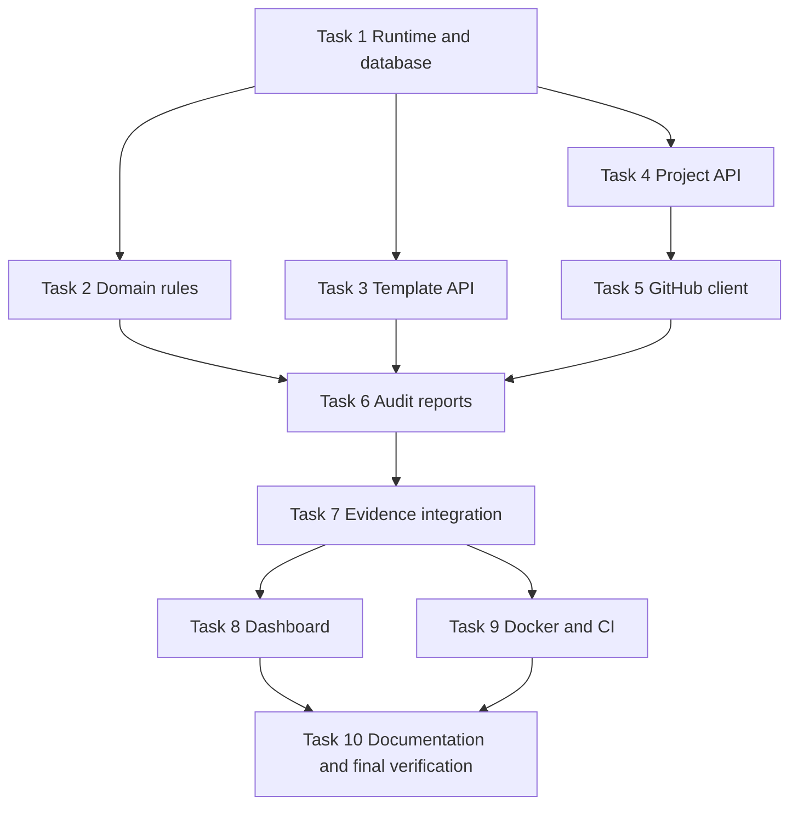

# ShipCheck Implementation Plan

> **For agentic workers:** REQUIRED SUB-SKILL: Use `superpowers:subagent-driven-development` (recommended) or `superpowers:executing-plans` to implement this plan task-by-task. Steps use checkbox (`- [ ]`) syntax for tracking.

**Goal:** Build a local-first delivery readiness dashboard that audits public GitHub repositories, tracks manual evidence, and stores immutable readiness reports.

**Architecture:** Express serves JSON routes and a static dashboard. Focused domain modules perform validation and scoring, repositories persist records through Node 24 native SQLite, and an injected GitHub client allows real production audits with deterministic tests.

**Tech Stack:** Node.js 24, Express 5, `node:sqlite`, native `fetch`, `node:test`, static HTML/CSS/browser JavaScript, Docker, GitHub Actions.

---

## 1. File Map

| Path | Responsibility |
| --- | --- |
| `package.json` | Runtime metadata and one-command scripts |
| `src/server.js` | Process entrypoint and graceful startup |
| `src/app.js` | Express composition, error handling, request logs, static files |
| `src/config.js` | Environment parsing |
| `src/db/database.js` | SQLite connection helper |
| `src/db/migrate.js` | Schema creation and built-in template seed |
| `src/domain/errors.js` | Stable application errors |
| `src/domain/github-url.js` | Repository URL normalization |
| `src/domain/template.js` | Template input validation |
| `src/domain/rules.js` | Automated rule evaluation |
| `src/domain/report.js` | Snapshot scoring and status |
| `src/repositories/template-repository.js` | Template persistence |
| `src/repositories/project-repository.js` | Project persistence |
| `src/repositories/evidence-repository.js` | Evidence persistence |
| `src/repositories/report-repository.js` | Immutable report persistence |
| `src/services/github-client.js` | GitHub REST adapter |
| `src/services/audit-service.js` | Audit orchestration |
| `src/routes/health-routes.js` | Health endpoint |
| `src/routes/template-routes.js` | Template endpoints |
| `src/routes/project-routes.js` | Project and evidence endpoints |
| `src/routes/report-routes.js` | Audit and report endpoints |
| `src/public/` | Open Design-informed dashboard |
| `test/` | Unit and HTTP integration tests |

## 2. Dependency Graph And Worktrees



Recommended feature worktrees after Task 1 establishes the baseline:

| Worktree branch | Tasks | Parallelism |
| --- | --- | --- |
| `feature/domain-rules` | Task 2 | Parallel with Tasks 3 and 4 |
| `feature/template-api` | Task 3 | Parallel with Tasks 2 and 4 |
| `feature/project-api` | Task 4 | Parallel with Tasks 2 and 3 |
| `feature/audit-reports` | Tasks 5, 6, 7 | Starts after project API; Task 6 waits for domain rules and templates |
| `feature/dashboard` | Task 8 | Starts after API integration |
| `chore/delivery` | Tasks 9, 10 | Task 9 can overlap dashboard work |

The local exercise may merge feature branches locally because no GitHub remote is configured. Each feature branch still preserves worktree-oriented commit boundaries and subagent attribution.

If an isolated validation harness cannot load Superpowers skills, the worker must continue with direct strict RED-GREEN-REFACTOR TDD and the deviation must be recorded in `SPEC_PROCESS.md`.

## 3. Task Checklist

### Task 1: Runtime, Database, And Built-In Template

**Depends on:** Approved spec.

**Files:**

- Create: `package.json`
- Create: `src/db/database.js`
- Create: `src/db/migrate.js`
- Create: `test/helpers/database.js`
- Test: `test/db/migrate.test.js`

- [ ] **Step 1: Add the failing migration test**

Create `test/db/migrate.test.js` that opens an in-memory database, calls `migrateDatabase(db)`, and asserts that `templates`, `template_items`, `projects`, `evidence`, and `reports` exist and that exactly one built-in template named `AI4SE Final Project` is seeded.

- [ ] **Step 2: Verify RED**

Run: `npm test -- test/db/migrate.test.js`

Expected: FAIL because `src/db/migrate.js` does not exist.

- [ ] **Step 3: Implement the minimal migration**

Add `package.json` scripts:

```json
{
  "scripts": {
    "start": "node src/server.js",
    "test": "node --test --test-concurrency=1",
    "test:coverage": "node --test --test-concurrency=1 --experimental-test-coverage"
  }
}
```

Use `DatabaseSync` from `node:sqlite`, enable foreign keys, create the five tables from `SPEC.md`, and seed the protected AI4SE checklist with the exact ten ordered items enumerated in `SPEC.md` section 5.2.

- [ ] **Step 4: Verify GREEN**

Run: `npm test -- test/db/migrate.test.js`

Expected: PASS.

- [ ] **Step 5: Commit**

```bash
git add package.json src test/helpers test/db
git commit -m "feat: add SQLite baseline and built-in checklist [subagent: runtime]"
```

### Task 2: Domain Validation, Rule Evaluation, And Scoring

**Depends on:** Task 1.

**Files:**

- Create: `src/domain/github-url.js`
- Create: `src/domain/errors.js`
- Create: `src/domain/template.js`
- Create: `src/domain/rules.js`
- Create: `src/domain/report.js`
- Test: `test/domain/github-url.test.js`
- Test: `test/domain/template.test.js`
- Test: `test/domain/rules.test.js`
- Test: `test/domain/report.test.js`

- [ ] **Step 1: Add failing URL tests**

Test normalization of `https://github.com/obra/superpowers.git/` to owner `obra`, repository `superpowers`, and canonical URL `https://github.com/obra/superpowers`. Test rejection of blank names, unsupported hosts, extra path segments, query strings, and fragments.

- [ ] **Step 2: Verify URL tests RED**

Run: `npm test -- test/domain/github-url.test.js`

Expected: FAIL because `normalizeGitHubUrl` is missing.

- [ ] **Step 3: Implement URL normalization and verify GREEN**

Parse with `new URL()`, validate the host and segments, remove one `.git` suffix, and throw `AppError.badRequest(...)` for invalid values.

- [ ] **Step 4: Add failing template tests**

Test accepted automated and manual items. Test rejection of duplicate keys, unknown rule types, automated items without rules, manual items with rules, and empty item lists.

- [ ] **Step 5: Implement template validation and verify GREEN**

Run: `npm test -- test/domain/template.test.js`

Expected: PASS after minimal implementation.

- [ ] **Step 6: Add failing rule and report tests**

Use metadata and a tree-path set to test all four supported rules. Test score rounding and `ready` versus `blocked` status, including pending manual items.

- [ ] **Step 7: Implement rule evaluation and report snapshot creation**

Run: `npm test -- test/domain`

Expected: PASS.

- [ ] **Step 8: Commit**

```bash
git add src/domain test/domain
git commit -m "feat: add audit domain rules and scoring [subagent: domain]"
```

### Task 3: Template Repository And API

**Depends on:** Task 1.

**Files:**

- Create: `src/repositories/template-repository.js`
- Create: `src/routes/template-routes.js`
- Create: `src/app.js`
- Create: `test/helpers/app.js`
- Test: `test/api/templates.test.js`

- [ ] **Step 1: Add failing template API tests**

Cover:

```text
GET /api/templates
GET /api/templates/:id
POST /api/templates/:id/copy
PUT /api/templates/:id
DELETE /api/templates/:id
```

Assert that the built-in template is listed, may be copied, and rejects mutation with `409`. Assert that custom copies accept valid edits and may be deleted while unused.

- [ ] **Step 2: Verify RED**

Run: `npm test -- test/api/templates.test.js`

Expected: FAIL because app and routes are missing.

- [ ] **Step 3: Implement repository and routes**

Use prepared SQLite statements. Keep serialization in the repository and convert domain errors to the stable envelope in `src/app.js`.

- [ ] **Step 4: Verify GREEN**

Run: `npm test -- test/api/templates.test.js`

Expected: PASS.

- [ ] **Step 5: Commit**

```bash
git add src/app.js src/repositories/template-repository.js src/routes/template-routes.js test/helpers/app.js test/api/templates.test.js
git commit -m "feat: add editable checklist templates API [subagent: templates]"
```

### Task 4: Project Repository And API

**Depends on:** Tasks 1 and 2 URL normalization.

**Files:**

- Create: `src/repositories/project-repository.js`
- Create: `src/routes/project-routes.js`
- Test: `test/api/projects.test.js`
- Modify: `src/app.js`

- [ ] **Step 1: Add failing project API tests**

Cover list, create, fetch, update, and delete. Assert canonical URL storage, template linkage, latest report summary placeholder, validation errors, and `404` for unknown IDs.

- [ ] **Step 2: Verify RED**

Run: `npm test -- test/api/projects.test.js`

Expected: FAIL because project routes are missing.

- [ ] **Step 3: Implement repository and routes**

Normalize repository URLs before persistence. Return ISO timestamps and stable JSON envelopes.

- [ ] **Step 4: Verify GREEN**

Run: `npm test -- test/api/projects.test.js`

Expected: PASS.

- [ ] **Step 5: Commit**

```bash
git add src/app.js src/repositories/project-repository.js src/routes/project-routes.js test/api/projects.test.js
git commit -m "feat: add project tracking API [subagent: projects]"
```

### Task 5: GitHub REST Client

**Depends on:** Task 4.

**Files:**

- Create: `src/services/github-client.js`
- Test: `test/services/github-client.test.js`

- [ ] **Step 1: Add failing client tests**

Inject a fake `fetch` implementation. Assert:

- Metadata and recursive tree requests use the expected GitHub endpoints and headers.
- `GITHUB_TOKEN` becomes a bearer header when present.
- `404` maps to `github_repository_not_found`.
- exhausted `403` maps to `github_rate_limited`.
- upstream `500` and thrown network errors map to `github_unavailable`.
- an empty repository returns an empty tree with a warning.
- a truncated tree returns entries plus a warning.

- [ ] **Step 2: Verify RED**

Run: `npm test -- test/services/github-client.test.js`

Expected: FAIL because `GitHubClient` is missing.

- [ ] **Step 3: Implement minimal client**

Expose `getRepositorySnapshot(owner, repo)`. Do not call a shell, clone a repository, or persist tokens.

- [ ] **Step 4: Verify GREEN**

Run: `npm test -- test/services/github-client.test.js`

Expected: PASS.

- [ ] **Step 5: Commit**

```bash
git add src/services/github-client.js test/services/github-client.test.js
git commit -m "feat: add public GitHub repository client [subagent: github-client]"
```

### Task 6: Audit Service And Immutable Reports

**Depends on:** Tasks 2, 3, 4, and 5.

**Files:**

- Create: `src/repositories/report-repository.js`
- Create: `src/repositories/evidence-repository.js`
- Create: `src/services/audit-service.js`
- Create: `src/routes/report-routes.js`
- Test: `test/services/audit-service.test.js`
- Test: `test/api/reports.test.js`
- Modify: `src/app.js`

- [ ] **Step 1: Add failing audit service test**

Create a project and inject a fake GitHub client returning repository metadata and paths. Assert a stored report snapshot contains per-item results, GitHub metadata, warnings, rounded score, and `blocked` status.

- [ ] **Step 2: Verify RED**

Run: `npm test -- test/services/audit-service.test.js`

Expected: FAIL because `AuditService` is missing.

- [ ] **Step 3: Implement report repository and audit orchestration**

Evaluate rule items, merge pending manual items, call report scoring, save immutable JSON, and return the saved snapshot.

- [ ] **Step 4: Add failing report route tests**

Cover:

```text
POST /api/projects/:id/audits
GET /api/projects/:id/reports
GET /api/projects/:id/reports/:reportId
```

Assert upstream error envelopes and report ordering newest first.

- [ ] **Step 5: Implement routes and verify GREEN**

Run: `npm test -- test/services/audit-service.test.js test/api/reports.test.js`

Expected: PASS.

- [ ] **Step 6: Commit**

```bash
git add src/app.js src/repositories src/services/audit-service.js src/routes/report-routes.js test/services/audit-service.test.js test/api/reports.test.js
git commit -m "feat: generate immutable readiness reports [subagent: audits]"
```

### Task 7: Manual Evidence And Health Endpoint

**Depends on:** Task 6.

**Files:**

- Create: `src/routes/health-routes.js`
- Test: `test/api/evidence.test.js`
- Test: `test/api/health.test.js`
- Modify: `src/routes/project-routes.js`
- Modify: `src/app.js`

- [ ] **Step 1: Add failing evidence tests**

Cover upsert, edit, invalid URL, completed evidence without text, unknown item, and rejection of evidence for automated items. Run a second audit and assert captured manual evidence changes score and remains immutable in the first report.

- [ ] **Step 2: Verify RED**

Run: `npm test -- test/api/evidence.test.js`

Expected: FAIL because evidence route is missing.

- [ ] **Step 3: Implement evidence route**

Validate evidence URLs with `new URL()`, restrict protocols to `http:` and `https:`, and verify item kind against the current template.

- [ ] **Step 4: Add health test and implementation**

Assert `GET /api/health` returns `{ "status": "ok" }`.

- [ ] **Step 5: Verify GREEN**

Run: `npm test -- test/api/evidence.test.js test/api/health.test.js`

Expected: PASS.

- [ ] **Step 6: Commit**

```bash
git add src/app.js src/routes src/repositories/evidence-repository.js test/api/evidence.test.js test/api/health.test.js
git commit -m "feat: track manual evidence and expose health check [subagent: evidence]"
```

### Task 8: Open Design-Informed Dashboard

**Depends on:** Task 7.

**Files:**

- Create: `src/public/index.html`
- Create: `src/public/styles.css`
- Create: `src/public/app.js`
- Test: `test/ui/static-assets.test.js`
- Modify: `src/app.js`

- [ ] **Step 1: Add failing static asset tests**

Assert `/` serves an HTML dashboard with the ShipCheck title, `/styles.css` exposes Linear-inspired tokens, and `/app.js` is served as JavaScript.

- [ ] **Step 2: Verify RED**

Run: `npm test -- test/ui/static-assets.test.js`

Expected: FAIL because static assets are missing.

- [ ] **Step 3: Implement dashboard shell**

Build four focused views in browser JavaScript:

- Project list with score and readiness state.
- Create-project form.
- Project detail with run-audit action, checklist results, evidence form, and report history.
- Template list with copy and custom edit actions.

Use Open Design `dashboard` and `linear-app` rules: near-black canvas, restrained indigo accent, semi-transparent borders, dense sidebar layout, visible focus states, responsive collapse, and no decorative gradients.

- [ ] **Step 4: Verify GREEN**

Run: `npm test -- test/ui/static-assets.test.js`

Expected: PASS.

- [ ] **Step 5: Run Open Design self-critique**

Check hierarchy, contrast, responsive layout, empty states, loading states, validation errors, keyboard focus, and avoidance of generic AI dashboard decoration. Record findings in `AGENT_LOG.md`.

- [ ] **Step 6: Commit**

```bash
git add src/app.js src/public test/ui AGENT_LOG.md
git commit -m "feat: add Linear-inspired readiness dashboard [subagent: dashboard]"
```

### Task 9: Server Entrypoint, Docker, And CI

**Depends on:** Task 7. Can run parallel with Task 8.

**Files:**

- Create: `src/server.js`
- Create: `Dockerfile`
- Create: `.dockerignore`
- Create: `.github/workflows/ci.yml`
- Test: `test/config.test.js`
- Test: `test/server.test.js`

- [ ] **Step 1: Add failing configuration tests**

Assert default port `3000`, default database path `data/shipcheck.sqlite`, optional `GITHUB_TOKEN`, and integer validation for `PORT`.

- [ ] **Step 2: Verify RED**

Run: `npm test -- test/config.test.js`

Expected: FAIL until config parsing is complete.

- [ ] **Step 3: Implement server entrypoint**

Create the data directory, open the database, migrate it, build the app, listen on configured port, and close cleanly on `SIGINT` and `SIGTERM`.

- [ ] **Step 4: Add Docker and CI configuration**

Use Node `24-bookworm-slim`, install production dependencies, expose port `3000`, persist `/app/data`, and run `node src/server.js`. Configure GitHub Actions to run `npm ci`, `npm test`, and `docker build -t shipcheck:test .`.

- [ ] **Step 5: Verify available checks**

Run: `npm test`

Expected: PASS.

Run where Docker is available: `docker build -t shipcheck:local .`

Expected: Image builds successfully.

- [ ] **Step 6: Commit**

```bash
git add src/server.js src/config.js Dockerfile .dockerignore .github test/config.test.js test/server.test.js
git commit -m "chore: add runnable server Docker image and CI [subagent: delivery]"
```

### Task 10: README, Delivery Evidence, And Final Review

**Depends on:** Tasks 8 and 9.

**Files:**

- Create: `README.md`
- Create: `REFLECTION.md`
- Modify: `PLAN.md`
- Modify: `SPEC_PROCESS.md`
- Modify: `AGENT_LOG.md`

- [ ] **Step 1: Write README**

Document the pitch, features, architecture, Node requirement, local commands, environment variables, test command, Docker commands, API summary, directory structure, GitHub API limits, Open Design attribution, third-party license list, and deployment notes.

- [ ] **Step 2: Update process evidence**

Add cold-start findings, key before/after specification diff, task commits, subagent reviews, deviations, and local environment limitations.

- [ ] **Step 3: Create reflection outline**

Create a clearly marked student-authored reflection worksheet. Do not generate the final 1500-2500 Chinese-character reflection because the course explicitly requires the student to write it.

- [ ] **Step 4: Run full verification**

Run:

```bash
npm test
npm run test:coverage
npm start
```

Then request:

```text
GET http://localhost:3000/api/health
```

Expected: all tests pass and health returns HTTP `200`.

- [ ] **Step 5: Request final two-stage review**

Review against `SPEC.md`, then review code quality and test gaps. Fix Critical and Important findings.

- [ ] **Step 6: Commit**

```bash
git add README.md REFLECTION.md PLAN.md SPEC_PROCESS.md AGENT_LOG.md
git commit -m "docs: complete ShipCheck delivery evidence [primary: Codex]"
```

## 4. Verification Matrix

| Requirement | Test Or Evidence |
| --- | --- |
| Public GitHub repository normalization | `test/domain/github-url.test.js` |
| Built-in template and editable copies | `test/api/templates.test.js` |
| Real GitHub API adapter and error mapping | `test/services/github-client.test.js` |
| Audit rules, scores, statuses | `test/domain/rules.test.js`, `test/domain/report.test.js` |
| Immutable report history | `test/api/reports.test.js`, `test/api/evidence.test.js` |
| Stable API envelopes | API integration tests |
| Health endpoint | `test/api/health.test.js` |
| Dashboard assets | `test/ui/static-assets.test.js` |
| One-command tests | `npm test` |
| Docker and CI | `Dockerfile`, `.github/workflows/ci.yml` |

## 5. Plan Self-Review

- Every acceptance criterion in `SPEC.md` maps to a task and verification entry.
- Domain names remain consistent: `item_key`, `repo_owner`, `repo_name`, `snapshot_json`, `ready`, `blocked`, `automated`, `manual`, `blocking`, and `advisory`.
- No task requires Python, Docker at local test time, `gh`, or `make`.
- Docker image execution remains verifiable in CI even though Docker is unavailable on the local workstation.
- Generated configuration files are exempt from test-first ordering only where no executable behavior exists. Runtime behavior remains test-first.
