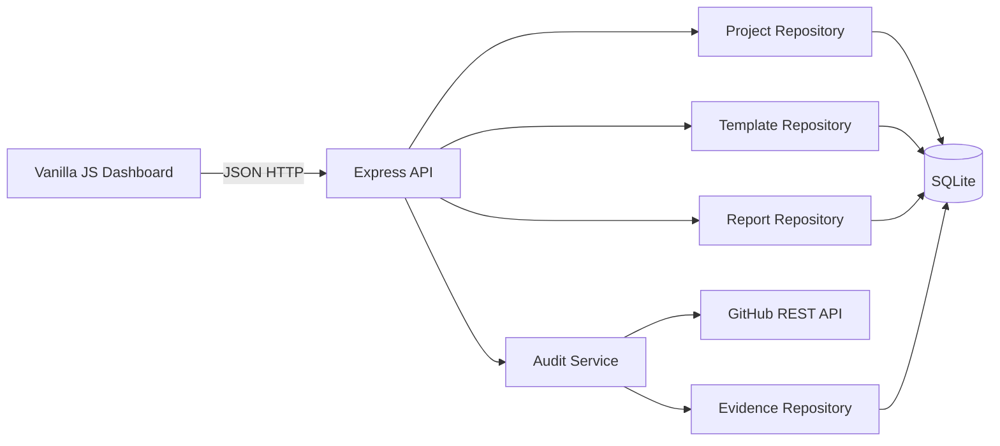

# ShipCheck Product Specification

## 1. Problem Statement

Small software projects often fail at delivery time for reasons unrelated to the core feature: the README is incomplete, tests are not runnable, Docker instructions are stale, required evidence is missing, or CI does not build the image. A developer can inspect these items manually, but the work is repetitive and the result is difficult to track.

ShipCheck is a local-first delivery readiness dashboard. A student or independent developer registers a public GitHub repository, chooses a checklist template, runs an audit, adds evidence for manual checks, and receives a readiness report with blocking issues.

### Target User

The primary user is an individual developer preparing a project submission or release. Version 1 is deliberately single-user and local-first: no login, no team collaboration, and no hosted database.

### Thirty-Second Pitch

ShipCheck tells you whether a GitHub project is actually ready to hand in or release. It checks the repository for documents, tests, Docker and CI, combines those results with manual evidence, and produces a clear report of what still blocks delivery.

## 2. Scope

### In Scope

- Register, edit, list, view, and delete projects that point to public GitHub repositories.
- Provide one built-in AI4SE final project template.
- Copy a built-in template into an editable custom template.
- Run a real GitHub API audit against a public repository.
- Store automated check results, manual evidence, report snapshots, and audit metadata.
- Show a dashboard, project detail view, template editor, and report history.
- Support an optional `GITHUB_TOKEN` to increase API rate limits.
- Run locally with `npm start` or one Docker build plus one Docker run.

### Out of Scope

- User accounts, authorization, teams, comments, notifications, and billing.
- Private repositories and OAuth.
- Executing untrusted repository code.
- Cloning repositories.
- Webhooks and scheduled background audits.
- Cloud deployment automation.

## 3. Brainstorming Alternatives

### A. Fixed AI4SE Script

A CLI script could inspect one repository and print results. This is fastest to build, but it is too narrow: it does not track evidence, templates, project history, or report snapshots.

### B. Local-First Web Dashboard (Selected)

A small web application stores local SQLite data, reads public repository metadata through GitHub's API, and serves a dashboard. It is a real product while remaining deterministic enough for TDD and containerization.

### C. Multi-User SaaS

A hosted service with authentication, PostgreSQL, workers, and scheduled checks would be realistic but adds infrastructure that does not improve the core learning objective. It is deferred.

## 4. User Stories

1. As a developer, I want to register a public GitHub repository so that I can track whether it is ready to deliver.
2. As a developer, I want to run automated checks so that missing files and invalid repository settings are found without manual inspection.
3. As a developer, I want to add evidence for manual checklist items so that non-automatable requirements are still represented in the report.
4. As a developer, I want to copy and edit a checklist template so that the tool can fit assignments other than the built-in AI4SE template.
5. As a developer, I want to inspect blocking checks separately from advisory checks so that I know what must be fixed first.
6. As a developer, I want report snapshots to remain available after later audits so that I can show progress over time.
7. As a developer, I want actionable GitHub API errors so that rate limits and invalid repositories are not confused with failed checks.

## 5. Functional Specification

### 5.1 Project Management

**Input:** Project name, public GitHub repository URL, and template ID.

**Behavior:** Normalize URLs in `https://github.com/{owner}/{repo}` form. Store owner and repository name separately. Projects use the selected template as a live reference: later edits to that template affect future audits, while report snapshots remain immutable.

**Output:** Project records with ID, name, repository URL, template summary, latest report summary, and timestamps.

**Boundary Conditions:**

- Trim project names.
- Reject blank names.
- Reject non-GitHub URLs, URLs without exactly one owner and one repository segment, query strings, fragments, and unsupported hosts.
- Remove one optional trailing slash and one optional `.git` suffix.
- Allow two projects to refer to the same repository if their names differ.

**Errors:** Validation failures return HTTP `400`. Unknown project IDs return `404`.

### 5.2 Template Management

**Input:** Template name and an ordered list of checklist items.

Each checklist item has:

- `key`: stable kebab-case identifier unique inside the template.
- `title`: human-readable name.
- `description`: what completion means.
- `kind`: `automated` or `manual`.
- `severity`: `blocking` or `advisory`.
- `rule`: an automated rule object or `null` for manual checks.

Supported automated rules:

- `{ "type": "file_exists", "path": "README.md" }`
- `{ "type": "file_any_exists", "paths": ["Dockerfile", "docker-compose.yml"] }`
- `{ "type": "directory_exists", "path": ".github/workflows" }`
- `{ "type": "repository_has_description" }`

The built-in `AI4SE Final Project` template contains these ordered items:

| Key | Kind | Severity | Rule Or Evidence Expectation |
| --- | --- | --- | --- |
| `readme` | `automated` | `blocking` | `{ "type": "file_exists", "path": "README.md" }` |
| `docker` | `automated` | `blocking` | `{ "type": "file_any_exists", "paths": ["Dockerfile", "docker-compose.yml"] }` |
| `ci-workflow` | `automated` | `blocking` | `{ "type": "directory_exists", "path": ".github/workflows" }` |
| `repository-description` | `automated` | `advisory` | `{ "type": "repository_has_description" }` |
| `spec-document` | `manual` | `blocking` | Evidence that `SPEC.md` was reviewed. |
| `plan-document` | `manual` | `blocking` | Evidence that `PLAN.md` was reviewed. |
| `cold-start-validation` | `manual` | `blocking` | Evidence of the isolated second-agent validation. |
| `agent-log` | `manual` | `blocking` | Evidence that `AGENT_LOG.md` records the workflow. |
| `public-image` | `manual` | `blocking` | Public Docker Hub or GHCR image URL. |
| `reflection` | `manual` | `advisory` | Evidence that the student-authored reflection is present. |

**Behavior:** Ship one protected built-in template named `AI4SE Final Project`. A built-in template may be read or copied, but not edited or deleted. Custom templates may be created by copying an existing template, edited, and deleted when no project references them.

**Output:** Template records with item counts, built-in status, and ordered items.

**Boundary Conditions:** Reject duplicate keys, unsupported rule types, automated items without a rule, manual items with a rule, empty templates, and deletion of referenced templates.

**Errors:** Validation failures return `400`; protected or referenced template mutations return `409`; unknown IDs return `404`.

### 5.3 GitHub Audit

**Input:** Project ID.

**Behavior:**

1. Fetch repository metadata with `GET /repos/{owner}/{repo}`.
2. Fetch the recursive repository tree using the default branch SHA from repository metadata.
3. Evaluate supported automated rules against metadata and tree entries without cloning or executing repository code.
4. Reuse the latest manual evidence for the same project and checklist item.
5. Store an immutable report snapshot.

**Output:** A report snapshot containing score, counts, status, generated time, audit source metadata, and per-item results.

**Score:** `passed items / total items * 100`, rounded to the nearest integer. Manual items without evidence are `pending` and do not count as passed.

**Overall Status:**

- `ready`: every blocking item passed.
- `blocked`: at least one blocking item failed or is pending.

**Boundary Conditions:** An empty Git repository has no default branch tree and all file-based checks fail with a clear detail message. Tree truncation is surfaced as an audit warning.

**Errors:**

- GitHub `404` becomes HTTP `422` with code `github_repository_not_found`.
- GitHub `403` with exhausted rate limit becomes HTTP `429` with code `github_rate_limited`.
- Network or upstream `5xx` failures become HTTP `502` with code `github_unavailable`.
- Invalid project IDs return `404`.

### 5.4 Manual Evidence

**Input:** Project ID, checklist item key, evidence text, optional URL, and completion boolean.

**Behavior:** Manual evidence is upserted per project and checklist item. Evidence remains editable. The next audit incorporates its latest state.

**Output:** Stored evidence and timestamp.

**Boundary Conditions:** Accept evidence only for manual items in the project's current template. Require non-empty evidence text when completion is true. If supplied, evidence URLs must use `http` or `https`.

**Errors:** Invalid evidence returns `400`; unknown project or item returns `404`; automated items return `409`.

### 5.5 Reports

**Input:** Project ID and optional report ID.

**Behavior:** List immutable report snapshots newest first and fetch one full snapshot. Reports include automated details, manual evidence captured at audit time, warnings, and GitHub metadata.

**Output:** Summary or detailed report JSON and dashboard rendering.

**Errors:** Unknown project or report returns `404`.

## 6. Non-Functional Requirements

### Performance

- For repositories whose recursive tree contains at most 5,000 entries, an audit should complete in under 5 seconds excluding GitHub network latency.
- List endpoints should return in under 200 ms for 100 locally stored projects.

### Security

- Only the GitHub API host configured by the application is contacted.
- Repository URLs are parsed structurally; they are never interpolated into shell commands.
- Repository code is never cloned or executed.
- `GITHUB_TOKEN` is read from the environment and never persisted or returned by an endpoint.
- JSON request bodies are limited to 100 KB.

### Availability And Usability

- The server exposes `GET /api/health`.
- Validation and upstream failures return a stable error envelope:

```json
{
  "error": {
    "code": "stable_code",
    "message": "Human-readable explanation",
    "details": {}
  }
}
```

### Observability

- Each HTTP request receives a request ID and a structured JSON log line.
- Audit log lines include project ID, repository owner/name, result status, duration, and warning count.

## 7. Architecture



### Components

- `src/app.js`: application composition, middleware, and route registration.
- `src/db/`: SQLite connection and migration management.
- `src/repositories/`: persistence interfaces for templates, projects, evidence, and reports.
- `src/domain/`: URL normalization, template validation, rule evaluation, and report scoring.
- `src/services/`: GitHub client and audit orchestration.
- `src/routes/`: HTTP adapters with stable JSON envelopes.
- `src/public/`: Open Design-informed dashboard UI.

### Data Flow

The browser submits a repository URL. The API normalizes and stores it. On audit, the audit service obtains metadata and tree entries from the GitHub client, evaluates each automated item, merges current evidence for manual items, scores the report, saves the report snapshot, and returns it to the dashboard.

## 8. Data Model

### `templates`

| Field | Type | Constraint |
| --- | --- | --- |
| `id` | TEXT | Primary key |
| `name` | TEXT | Non-empty |
| `is_builtin` | INTEGER | `0` or `1` |
| `created_at` | TEXT | ISO timestamp |
| `updated_at` | TEXT | ISO timestamp |

### `template_items`

| Field | Type | Constraint |
| --- | --- | --- |
| `id` | TEXT | Primary key |
| `template_id` | TEXT | Foreign key |
| `item_key` | TEXT | Unique within template |
| `title` | TEXT | Non-empty |
| `description` | TEXT | Non-empty |
| `kind` | TEXT | `automated` or `manual` |
| `severity` | TEXT | `blocking` or `advisory` |
| `rule_json` | TEXT | JSON or null |
| `position` | INTEGER | Non-negative |

### `projects`

| Field | Type | Constraint |
| --- | --- | --- |
| `id` | TEXT | Primary key |
| `name` | TEXT | Non-empty |
| `repo_url` | TEXT | Normalized GitHub URL |
| `repo_owner` | TEXT | Non-empty |
| `repo_name` | TEXT | Non-empty |
| `template_id` | TEXT | Foreign key |
| `created_at` | TEXT | ISO timestamp |
| `updated_at` | TEXT | ISO timestamp |

### `evidence`

| Field | Type | Constraint |
| --- | --- | --- |
| `id` | TEXT | Primary key |
| `project_id` | TEXT | Foreign key |
| `item_key` | TEXT | Unique with project ID |
| `text` | TEXT | Non-empty when completed |
| `url` | TEXT | Optional HTTP(S) URL |
| `completed` | INTEGER | `0` or `1` |
| `updated_at` | TEXT | ISO timestamp |

### `reports`

| Field | Type | Constraint |
| --- | --- | --- |
| `id` | TEXT | Primary key |
| `project_id` | TEXT | Foreign key |
| `status` | TEXT | `ready` or `blocked` |
| `score` | INTEGER | `0..100` |
| `snapshot_json` | TEXT | Immutable report JSON |
| `created_at` | TEXT | ISO timestamp |

## 9. API Design

| Method | Endpoint | Purpose |
| --- | --- | --- |
| `GET` | `/api/health` | Health check |
| `GET` | `/api/templates` | List templates |
| `GET` | `/api/templates/:id` | Fetch template |
| `POST` | `/api/templates/:id/copy` | Copy template |
| `PUT` | `/api/templates/:id` | Update custom template |
| `DELETE` | `/api/templates/:id` | Delete unused custom template |
| `GET` | `/api/projects` | List projects with latest report |
| `POST` | `/api/projects` | Create project |
| `GET` | `/api/projects/:id` | Fetch project |
| `PUT` | `/api/projects/:id` | Update project |
| `DELETE` | `/api/projects/:id` | Delete project |
| `PUT` | `/api/projects/:id/evidence/:itemKey` | Upsert manual evidence |
| `POST` | `/api/projects/:id/audits` | Run GitHub audit |
| `GET` | `/api/projects/:id/reports` | List report summaries |
| `GET` | `/api/projects/:id/reports/:reportId` | Fetch report snapshot |

## 10. Technology Selection

- **Runtime:** Node.js 24. The local environment already provides Node.js, while Python is unavailable. Node 24 includes `node:sqlite`, native `fetch`, and the built-in test runner.
- **HTTP Framework:** Express 5 for a small, explicit routing layer.
- **Database:** SQLite through `node:sqlite`. It fits a local-first single-user application and remains easy to containerize.
- **Frontend:** Static HTML, CSS, and browser JavaScript served by Express. A build step is intentionally avoided to keep the Docker and CI paths simple.
- **Tests:** Node's built-in `node:test` runner plus HTTP integration tests against ephemeral SQLite databases.
- **Deployment:** One Node Docker image with a mounted `/app/data` directory.

### Open Design Selection

The UI uses Open Design repository commit `53fb175855e3e9b599353c4a48966f7022a05bc4`. The selected skill is `dashboard`, and the selected system is `linear-app`.

Linear's dark native surfaces, restrained indigo accent, subtle borders, and information-dense layout fit a developer tool. The implementation will borrow its visual rules, not third-party source code. Open Design is licensed under Apache-2.0 and is listed in the README acknowledgements.

## 11. Acceptance Criteria

1. `npm test` passes with unit and API integration tests.
2. `npm start` serves the dashboard and `GET /api/health` returns HTTP `200`.
3. A user can create a project using a valid public GitHub URL and receive a normalized stored URL.
4. Invalid repository URLs return the documented `400` error envelope.
5. The built-in template exists after database initialization and cannot be edited or deleted.
6. A built-in template can be copied and the copy can be edited.
7. A real audit of a public GitHub repository stores a report snapshot.
8. GitHub not-found, unavailable, and rate-limit responses map to the documented error codes.
9. Manual evidence is included in later immutable report snapshots.
10. Report status is `blocked` when any blocking item is failed or pending and `ready` otherwise.
11. A Dockerfile builds an image that starts with a single `docker run` command in an environment where Docker is installed.
12. GitHub Actions runs tests and builds the Docker image on every push and pull request.

## 12. Risks And Decisions

| Risk | Decision |
| --- | --- |
| GitHub unauthenticated API rate limit | Support optional `GITHUB_TOKEN`; show rate-limit error clearly. |
| Large repository tree may be truncated | Preserve warning in the report instead of silently claiming completeness. |
| Node SQLite version compatibility | Pin Docker to Node 24 and document the minimum runtime. |
| UI scope inflation | Use four focused views and no frontend framework. |
| Custom templates could become too generic | Support four explicit rule types only. |
| Public deployment would expose local state | Treat cloud deployment as optional and document local-first assumptions. |

## 13. Deliberate Omissions

ShipCheck does not execute repository tests, parse arbitrary YAML, validate Docker semantics, or authenticate users. Each omission reduces security or schedule risk while leaving a useful delivery readiness product.
